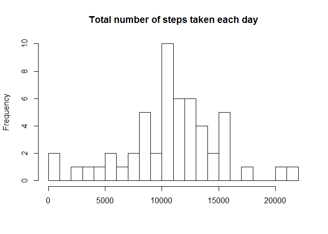
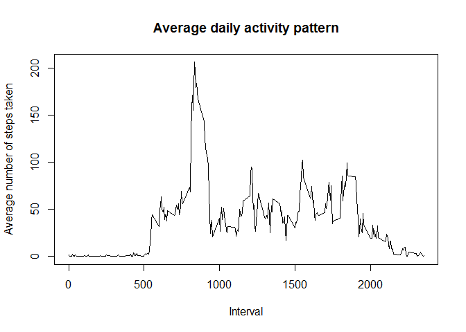
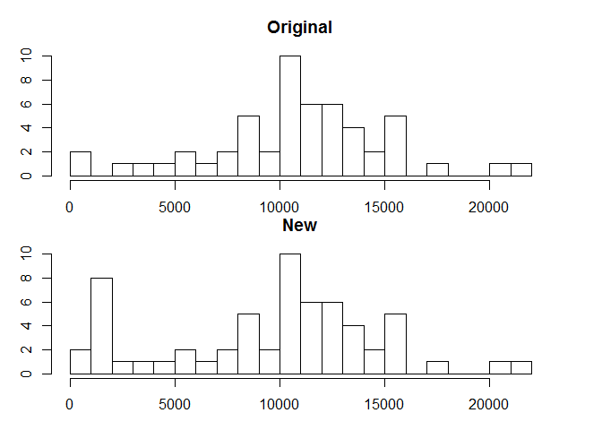
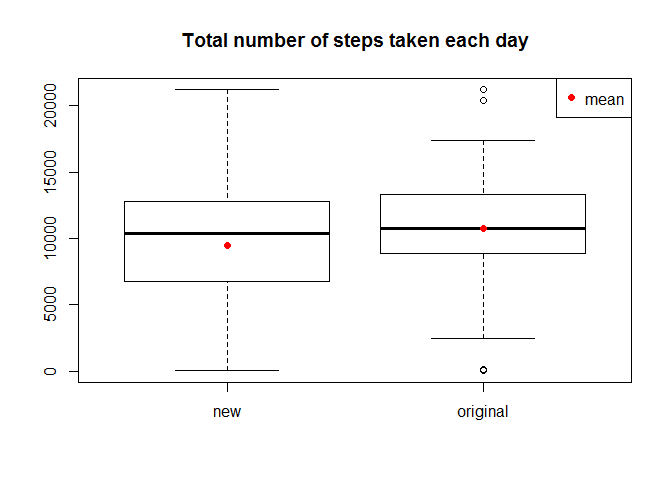
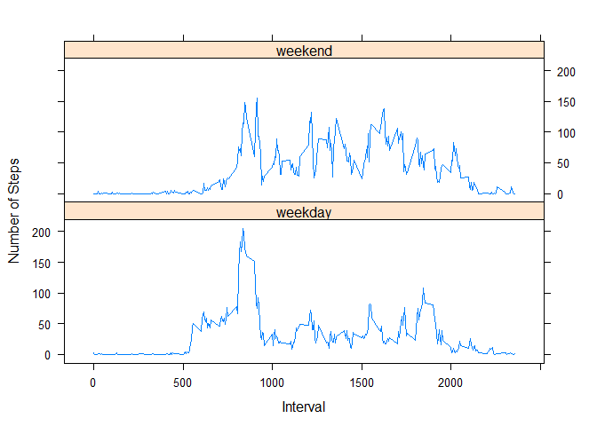

# Reproducible Research: Peer Assessment 1


## Loading and preprocessing the data
To perform this analysis, one need to fork/clone the data provided on this [github repository](http://github.com/rdpeng/RepData_PeerAssessment1).

The zip file "activity.zip" contains a single file activity.csv. Validate this by using the following command to inspect the contents of a zip file:

```r
filename = "activity.zip"
unzip(filename, list = TRUE)
```

```
##           Name Length                Date
## 1 activity.csv 350829 2014-02-11 10:08:00
```

Read the data using read.csv command:

```r
data <- read.csv(unz(filename, "activity.csv"))
summary(data)
```

```
##      steps                date          interval     
##  Min.   :  0.00   2012-10-01:  288   Min.   :   0.0  
##  1st Qu.:  0.00   2012-10-02:  288   1st Qu.: 588.8  
##  Median :  0.00   2012-10-03:  288   Median :1177.5  
##  Mean   : 37.38   2012-10-04:  288   Mean   :1177.5  
##  3rd Qu.: 12.00   2012-10-05:  288   3rd Qu.:1766.2  
##  Max.   :806.00   2012-10-06:  288   Max.   :2355.0  
##  NA's   :2304     (Other)   :15840
```

```r
dim(data)
```

```
## [1] 17568     3
```

```r
# import and turn data into data.table
library(dplyr)
```
## What is mean total number of steps taken per day?
**ANSWER** Mean is 10,770 steps and median is 10,760.

Calculate total number of steps taken each day, ignoring NA values:

```r
dailytotal <- data %>%
     na.omit() %>%
     group_by(date) %>%
     summarise(total = sum(steps))
head(dailytotal)
```

```
## Source: local data frame [6 x 2]
## 
##         date total
##       (fctr) (int)
## 1 2012-10-02   126
## 2 2012-10-03 11352
## 3 2012-10-04 12116
## 4 2012-10-05 13294
## 5 2012-10-06 15420
## 6 2012-10-07 11015
```

Now, show a histogram of total number of steps taken each day:

```r
hist(dailytotal$total, breaks = 30, xlab = NULL, main = "Total number of steps taken each day")
```

 

Display mean and median of the total number of steps taken each day:

```r
summary(dailytotal$total)
```

```
##    Min. 1st Qu.  Median    Mean 3rd Qu.    Max. 
##      41    8841   10760   10770   13290   21190
```
**ANSWER** *Mean is 10,770 steps and median is 10,760.*

## What is the average daily activity pattern?
Calculate average number of steps taken per interval, across all days

```r
dailyactivity <- data %>%
        na.omit() %>%
        group_by(interval) %>%
        summarise(mean = mean(steps))
```

Plot average daily activility pattern

```r
with(dailyactivity, plot(interval, mean, type = "l", xlab = "Interval", ylab = "Average number of steps taken", main = "Average daily activity pattern"))
```

 

Interval 835 contains the maximum number of steps, on average across all days in the dataset. In real terms, this would be around 1:55pm of the day.

```r
with(dailyactivity, dailyactivity[which(mean == max(mean)),])
```

```
## Source: local data frame [1 x 2]
## 
##   interval     mean
##      (int)    (dbl)
## 1      835 206.1698
```

**ANSWER** *Interval 835 contains the maximum number of steps*

## Imputing missing values
There are 2304 rows with NA out of 17568 rows. The only column containing NA is "steps"

```r
sum(!complete.cases(data))
```

```
## [1] 2304
```

After inspecting the NA data, a date is either entirely consisted of NA entries or consisted of valid observations. Here is a table showing number of NA by day:

```r
head(table(data$date, is.na(data$steps)),20)
```

```
##             
##              FALSE TRUE
##   2012-10-01     0  288
##   2012-10-02   288    0
##   2012-10-03   288    0
##   2012-10-04   288    0
##   2012-10-05   288    0
##   2012-10-06   288    0
##   2012-10-07   288    0
##   2012-10-08     0  288
##   2012-10-09   288    0
##   2012-10-10   288    0
##   2012-10-11   288    0
##   2012-10-12   288    0
##   2012-10-13   288    0
##   2012-10-14   288    0
##   2012-10-15   288    0
##   2012-10-16   288    0
##   2012-10-17   288    0
##   2012-10-18   288    0
##   2012-10-19   288    0
##   2012-10-20   288    0
```

The strategy I propose would be to use median number of steps for each interval, across all days to fill the NA. First, prepare a table with median step by interval, across all days.

```r
medianbyinterval <- data %>%
        na.omit() %>%
        group_by(interval) %>%
        summarise(median = median(steps))
```

Now, we assign the NA with the imputed values. First, we merge the median table and assign steps based on a if condition. We will use mapply for this step. The new data table is called imputedtbl:

```r
mergedtbl <- merge(data, medianbyinterval, by = "interval")
mergedtbl <- mutate(mergedtbl, steps = mapply(ifelse, is.na(steps), median, steps))
data.new <- select(mergedtbl, steps, date, interval)
```


Let's look at histogram for both new and original data:

```r
dailytotal.new <- data.new %>%
     na.omit() %>%
     group_by(date) %>%
     summarise(total = sum(steps))
par(mfrow = c(2,1), oma = c(2,2,0,0), mar = c(1,1,3,3))
hist(dailytotal$total, breaks = 30, xlab = NULL, main = "Original")
hist(dailytotal.new$total, breaks = 30, xlab = NULL, main = "New")
```

 

It turns out, the imputation has shifted the data to the lower end. Now, we will look at the mean and median to see if there is any difference:

```r
print("Original data")
```

```
## [1] "Original data"
```

```r
summary(dailytotal$total)
```

```
##    Min. 1st Qu.  Median    Mean 3rd Qu.    Max. 
##      41    8841   10760   10770   13290   21190
```

```r
print("New data after imputation")
```

```
## [1] "New data after imputation"
```

```r
summary(dailytotal.new$total)
```

```
##    Min. 1st Qu.  Median    Mean 3rd Qu.    Max. 
##      41    6778   10400    9504   12810   21190
```
The mean and median are lower for the new dataset compared to the original.Let's also look at an boxplot comparison.

```r
new <- data.frame(total = dailytotal.new$total, type = "new")
original <- data.frame(total = dailytotal$total, type = "original")
combined <- rbind.data.frame(new,original)
boxplot(combined$total ~ combined$type, main = "Total number of steps taken each day")
points(1:2, c(mean(dailytotal.new$total), mean(dailytotal$total)), pch = 16, col = 2)
legend("topright", legend = "mean", pch = 16, col = 2)
```

 

## Are there differences in activity patterns between weekdays and weekends?

First, we created a new variable called weekend in the data table. A helper function is created to help with this.


```r
whatday <- function(x) {
        day <- weekdays(strptime(x, "%Y-%m-%d"))
        ifelse(day %in% c("Sunday", "Saturday"), "weekend", "weekday")
}
data.new$weekend <- whatday(data.new$date)
```

Now, we are going to plot the data of average number of steps taken, averaged across all weekday days or weekend days.

```r
library(lattice)
mean <- data.new %>%
        na.omit() %>%
        group_by(interval, weekend) %>%
        summarise(mean = mean(steps))
xyplot(mean ~ interval | weekend, mean, type = "l", layout = c(1,2), xlab = "Interval", ylab = "Number of Steps")
```

 

**ANSWER** *The data indicates there are more the subject wakes up earlier and peak activity is more drastic during weekdays. During weekend, subject stays up later compared to weekdays.*
